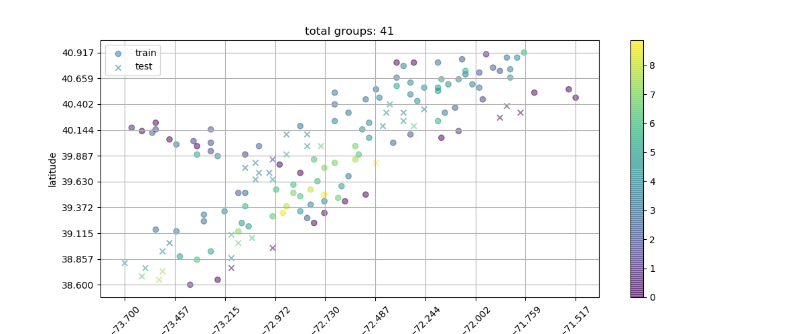

# Gaussian Process on Scallop DataSet

# Data
The scallop data is downloaded from http://matt-wand.utsacademics.info/webspr/scallop.html. It records 148 triplets concerning scallop abundance based on a 1990 survey cruise in the Atlantic continental shelf off Long Island, New York, U.S.A. It has 3 columns: longitude, latitude and tot.catch.

## Data preprocess
First I apply log(X + 1) transformation to the response variable. Then, I evenly divide longitude and latitude into 15 intervals and block the data. From these data groups, I randomly selected 80 precent groups as training data and others as testing data. The data grouping and test cases distribution among the whole area are as picture below.

# Run the code
Just run the GP_scallop.py
